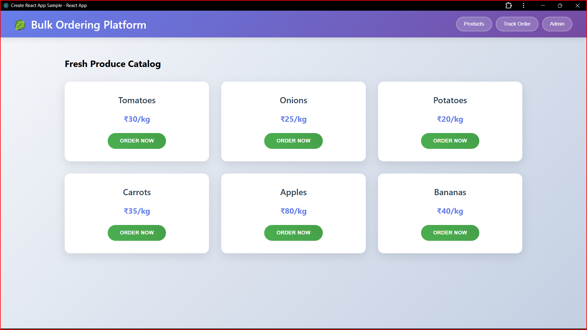
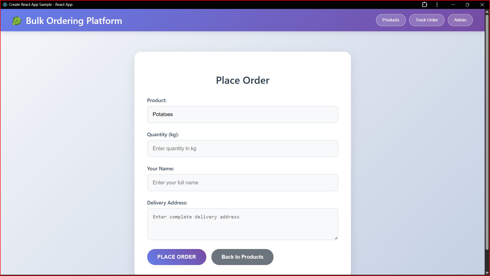
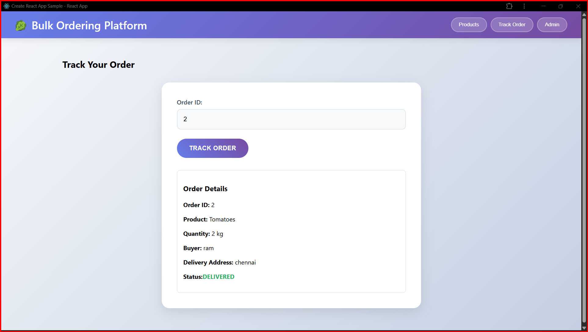
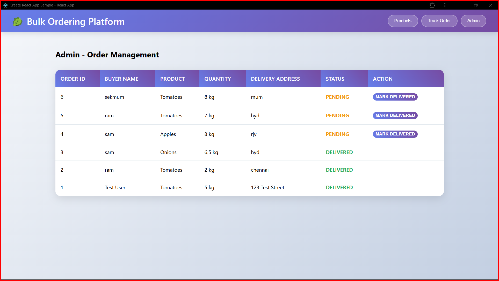

# Bulk Vegetable/Fruit Ordering Platform

A simple web application for bulk ordering of vegetables and fruits with admin order management.

## Tech Stack

**Frontend:**
- React.js
- CSS3
- Fetch API

**Backend:**
- Node.js
- Express.js
- SQLite3
- CORS

## Features Implemented

### For Buyers
- **Browse Products**: View catalog of vegetables/fruits with prices
- **Place Orders**: Order products with quantity, buyer details, and delivery address
- **Order Tracking**: Track order status using Order ID

### For Admin
- **Order Management**: View all orders with complete details
- **Status Updates**: Update order status from Pending to Delivered

## Database Schema

**Products Table:**
- id (Primary Key)
- name (Product name)
- price (Price per kg)

**Orders Table:**
- id (Primary Key, Order ID)
- product_name
- quantity
- buyer_name
- delivery_address
- status (Pending/Delivered)

## API Endpoints

- `GET /api/products` - Fetch all products
- `POST /api/orders` - Place a new order
- `GET /api/orders/:id` - Get order by ID
- `GET /api/admin/orders` - Get all orders (admin)
- `PUT /api/admin/orders/:id` - Update order status (admin)

## Steps to Run Locally

### Prerequisites
- Node.js (v14 or higher)
- npm

### Installation

1. **Clone the repository:**
```bash
git clone https://github.com/Sai6522/bulk-ordering-platform.git
cd bulk-ordering-platform
```

2. **Install dependencies:**
```bash
npm run install-all
```

3. **Start the application:**
```bash
npm run dev
```

This will start:
- Backend server on http://localhost:5000
- Frontend development server on http://localhost:3000

### Manual Setup (Alternative)

**Backend:**
```bash
cd backend
npm install
npm run dev
```

**Frontend (in new terminal):**
```bash
cd frontend
npm install
npm start
```

## Usage

1. **Browse Products**: Visit the main page to see available products
2. **Place Order**: Click "Order Now" on any product, fill the form
3. **Track Order**: Use the "Track Order" tab with your Order ID
4. **Admin Access**: Use the "Admin" tab to manage all orders

## Sample Products

The application comes with pre-loaded sample products:
- Tomatoes (₹30/kg)
- Onions (₹25/kg)
- Potatoes (₹20/kg)
- Carrots (₹35/kg)
- Apples (₹80/kg)
- Bananas (₹40/kg)

## Screenshots

### Product Catalog


### Order Form


### Order Tracking


### Admin Panel


## Deployment

### Frontend (Vercel/Netlify)
1. Build the frontend: `cd frontend && npm run build`
2. Deploy the `build` folder to Vercel or Netlify
3. Update API URLs in components to point to deployed backend

### Backend (Render)
1. Push code to GitHub
2. Connect repository to Render
3. Set build command: `cd backend && npm install`
4. Set start command: `cd backend && npm start`

## Future Enhancements

- User authentication
- Payment integration
- Real-time order updates
- Inventory management
- Order history
- Email notifications
